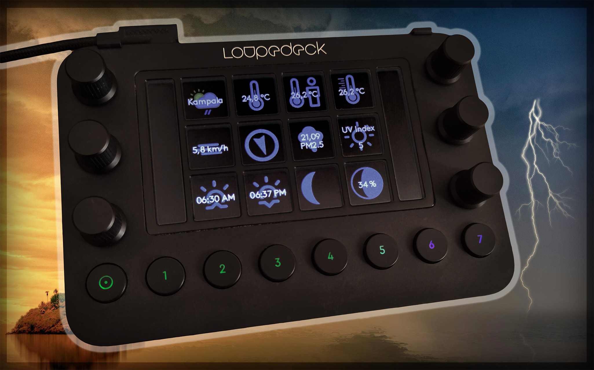

# Loupedeck Weather Plugin

## Credits

* Originally based on [loupedeck-weatherwidget](https://github.com/CZDanol/loupedeck-weatherwidget) by [Danol](https://github.com/CZDanol)
* Uses data and icons for weather conditions from [Weather API](https://www.weatherapi.com/)
* Additional icons from [Weather Icons](https://erikflowers.github.io/weather-icons/) by [Erik Flowers](https://github.com/erikflowers)
* Created using [Logi Actions SDK](https://www.logitech.com/en-eu/software/marketplace/developer.html)

## Requirements

* [Loupedeck Live, Live S, or CT](https://loupedeck.com/products/) (or compatible device)
* [Loupedeck Software](https://loupedeck.com/downloads/) version 6
* [Weather API](https://www.weatherapi.com/) account (free or paid)

## Installation

1. Download the `WeatherPlugin.lplug4` file from the [latest release](https://github.com/yanus/LoupedeckWeatherPlugin/releases/latest).
2. Open the file by double clicking **or** select it from within the Loupedeck software by choosing *Add-on Manager* from the profile menu and then *+ Install plugin from file*.
3. Confirm the installation dialogue that pops up.
4. Make sure that *Weather* is enabled under *Show and hide plugins* (button with two sliders in the main Loupedeck window).

## Usage

There are two actions available, **Weather Widget** and **Weather Slideshow**. As they share most of the settings, **Weather Widget** will be explained first, followed by aspects that are specific to **Weather Slideshow**.

The **Weather Widget** shows weather information for a selected location. The information is automatically refreshed every 5 minutes or when the touch button is pressed.

* **Name:** You can choose an arbitrary name to help you recognise the action later.
* **Location:** The location to show the weather for. You may include information like the state or country to avoid ambiguity. In doubt, check https://www.weatherapi.com/weather/.
* **Weather API Key:** Your API key from weatherapi.com. You need to sign up for a (free) account to get a key.
* **Forecast:** Here you can choose whether to show the current (real-time) weather, or a forecast for today or tomorrow. The available metrics depend on this.
* **Metric:** This determines what kind of weather information (e.g. temperature, pressure, wind speed) should be shown. For more information, check https://www.weatherapi.com/docs/#apis.
* **Icon:** You can choose to display an icon showing the current weather condition (e.g. partly cloudy), an icon representing the selected metric (e.g. humidity), or no icon at all.
* **Show location/metric/value:** If checked, the name of the location, the name of the selected metric, or its value will be shown.

The **Weather Slideshow** shows the same information as the **Weather Widget** but lets you specify up to 5 different metrics to be displayed in a loop. The metric changes at a specified interval or when the touch button is pressed.

* **Interval (s):** This value specifies after how many seconds the next metric should be displayed. If this is set to zero, the display is only changed when the touch button is pressed.
* **Metric 1-5:** Here you can specify the different metrics to be displayed.